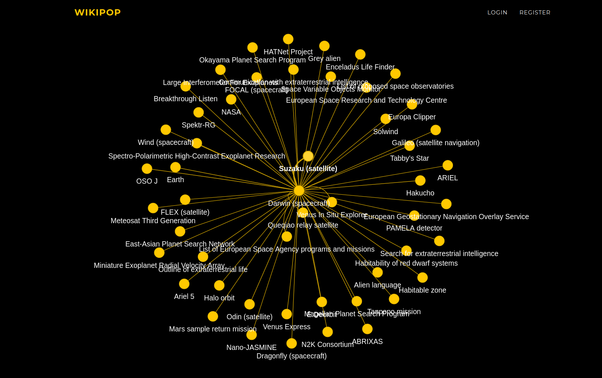

# Wikipop
Wikipop is a tool for easy wikipedia term visualization; is designed to create a comfortable visualization of terms extracted directly from wikipedia. 


## Installation
Due to the fact that packages of the app only work on specific Python versions (==**3.7.16**); we show below the instructions for easy installation of Python3.7 and setting the virtual environment:

### Python Version installation

For the particular case of linux the installation goes as proceeded depending on Distribution:

#### Ubuntu
```bash
sudo apt-get install python3.7
```

#### RHEL and Fedora
```bash
sudo dnf install python3.7
```

Installation can be verified with `python3.7 --version`

### Command line installation and requirements
```bash
git clone https://github.com/annabm99/wikipop.git
cd wikipop
```

Using Python's `-m venv` we can install the packages required by:
```bash
# Create a virtual environment:
python3.7 -m venv venv # Or name it as desired 
source venv/bin/activate
pip install -r requirements.txt
```

## Running the app
To start the app locally by running the command:
```bash
python3.7 run.py
```
And after getting something similar to this:
```bash
 * Serving Flask app 'market'
 * Debug mode: on
WARNING: This is a development server. Do not use it in a production deployment. Use a production WSGI server instead.
 * Running on http://127.0.0.1:5000
Press CTRL+C to quit
 * Restarting with stat
 * Debugger is active!
 * Debugger PIN: 114-896-245
```
You can open te app locally on the link provided.


